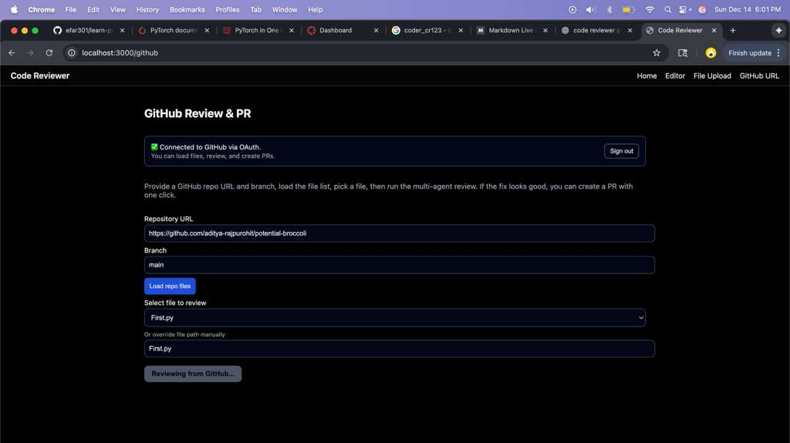
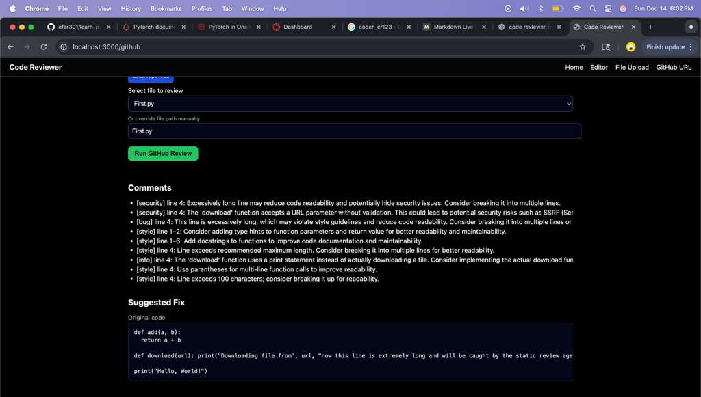
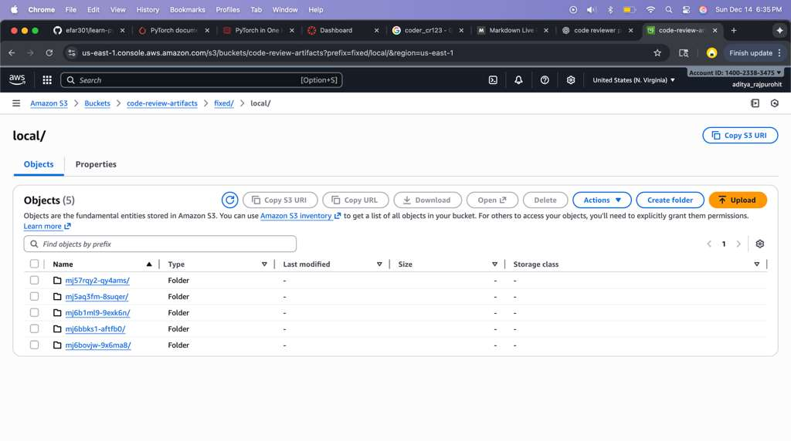

<h1 align="center">CODE REVIEWER</h1>

A full-stack **multi-agent LLM-powered code reviewer**, fix generator, evaluator, and GitHub PR automation system built using:

- **Amazon Bedrock (Claude Sonnet)**
- **Next.js + React (UI)**
- **Node.js + Express (API)**
- **PostgreSQL on AWS RDS**
- **AWS S3 (fixed-code artifacts)**
- **AWS CloudWatch Logs (AgentOps logging)**
- **GitHub OAuth + Octokit (PR creation)**

This project demonstrates an end-to-end **AI + Cloud MLOps pipeline** that reviews code, detects bugs/security issues, generates fixes, evaluates them, and integrates directly with GitHub.

---

<em>Built with the tools and technologies:</em>

<p></p>


---

## 🏗 System Architecture
```markdown
       +---------------------+         +----------------------+
       |     Frontend        |         |      Backend         |
       |  (Next.js / React)  |         | (Node.js + Express)  |
       +----------+----------+         +----------+-----------+
                  |                               |
                  |      API Requests             |
                  +------------------------------>|
                                                  |
                                                  v
      +----------------------------------------------------------+
      |                 Multi-Agent Orchestrator                 |
      |----------------------------------------------------------|
      |  StaticAgent → ReviewAgent → SecurityAgent → BugAgent →  |
      |               FixAgent → EvalAgent                       |
      |----------------------------------------------------------|
      |      Bedrock LLM calls, merging, evaluation, logging     |
      +------------------------------+---------------------------+
                                     |
                                     |
                +--------------------+----------------------+
                |                                           |
                |                                           |
                v                                           v
        +-----------------+                        +----------------------+
        |    AWS RDS      |                        |       AWS S3         |
        | (ReviewSession) |                        |     (artifacts)      |
        |   (PR Logs)     |                        +----------------------+
        +-------+---------+
                |
                |
                v
    +-----------------------+
    |    CloudWatch Logs    |
    | (Agent events + Eval) |
    +-----------------------+
```

---

## 📂 Repository Structure

```bash
code-reviewer/
├── apps/
│   ├── api/                # Express backend
│   │   ├── src/index.ts
│   │   ├── src/s3.ts
│   │   ├── src/parseGithubUrl.ts
│   ├── web/                # Next.js frontend
│       ├── app/local
│       ├── app/upload
│       ├── app/github
│       ├── components/
│       └── ...
├── packages/
│   ├── agents/             # multi-agent orchestration logic
│   ├── types/              # Shared Review types
│   ├── db/                 # Prisma + RDS
│   ├── github/             # GitHub connector
├── docs/
├── package.json
├── pnpm-workspace.yaml
├── .env.example
└── README.md
```

---

# 🌟 Features

### 🧠 **Multi-Agent Code Review Pipeline**
- **StaticAgent** — detects TODOs, unused patterns  
- **ReviewAgent** — deep semantic review (LLM)  
- **SecurityAgent** — finds SQL injection, secrets, unsafe logs  
- **BugDetectionAgent** — logic bugs, exception handling  
- **FixAgent** — rewrites & fixes code  
- **EvalAgent** — scores correctness, risk level, and summarizes improvements  

### 🔧 **Three Input Modes**
- Local editor (paste code)
- File upload
- GitHub repo file (OAuth + branch + file picker)

### 🤖 **Automated Fix Suggestions**
- Rewritten fixed code  
- Side-by-side display  
- Downloadable file  

### 🔐 **GitHub OAuth Integration**
- Login using GitHub  
- Load repo files  
- Review & create PRs using the authenticated user identity  

### ☁️ **Cloud MLOps**
- **RDS PostgreSQL** — review sessions, agent metrics, PR logs  
- **S3** — fixed code artifact storage  
- **CloudWatch Logs** — agent step logs and evaluation metrics  

---

### GitHub Review & PR Creation


### Multi-Agent Review Output


### Cloud MLOps Artifacts


---

# 🛠 Installation

Backend:
```bash
cd apps/api
pnpm install
pnpm dev
```

Frontend:
```bash
cd apps/web
pnpm install
pnpm dev
```

Prisma & DB:
```bash
cd packages/db
pnpm --filter @code-reviewer/db prisma migrate dev
```

---

# 🏁 Conclusion

This project demonstrates a complete AI-powered code review platform integrating:

- Multi-agent reasoning
- LLM fix generation
- Secure GitHub OAuth
- Automated PR creation
- Cloud MLOps (RDS, S3, CloudWatch)
- Full-stack user interface

---

# 📔 Project Artifacts:

[](https://youtu.be/HVczEzn-wek)

[](docs/slides.pdf)

[](docs/report.pdf)